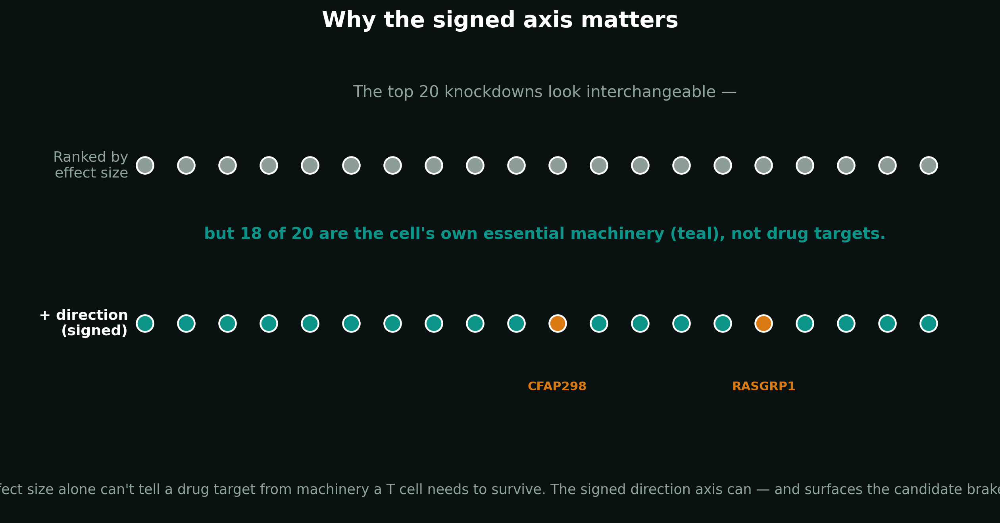

# Brakepoint: Genome-scale cancer-immunotherapy target discovery

**Chengchen (Sam) Duan — solo research-track submission**

**Brakepoint is a genome-scale discovery engine for the next generation of cancer-immunotherapy drug targets.** The best cancer immunotherapies cut the brakes off a patient's T cells. Only a handful of those brakes have ever been drugged. Brakepoint goes after the rest, reading an experiment spanning **2,638,736 single human T cells** and **12,449 gene knockdowns** to find the brakes worth testing. The result is a reproducible pipeline of five candidate targets and a blueprint for AI-native drug discovery.

**[Video walkthrough](deliverables/brakepoint_video.mp4)** · [Captions](deliverables/brakepoint_video.vtt) · [Slides](deliverables/brakepoint_slides.pptx) · [Script](deliverables/brakepoint_video_script.md) · [Interactive explorer of all 11,438 tested knockdowns](deliverables/index.html) · [Written summary](deliverables/summary.md) · [Methods deep-dive](pipeline/METHODS.md)


## The finding

**Brakepoint delivers five candidate T-cell brakes for the next experiment: CBLB, CD5, DGKA, SMAD3, and UBASH3A.**

**CBLB is the decisive proof point.** With zero prior target hints in the discovery ranking, Brakepoint recovered CBLB directly from the raw screen. The pharmaceutical industry is already taking this target into the clinic through **NX-1607 (Phase 1)** and **HST-1011 (Phase 1/2)**. Brakepoint found the signal independently, then prioritized four more candidate targets.

- **CBLB** — the lead candidate; an E3-ligase T-cell brake with clinical-stage inhibitors and an autoimmune genetic link.
- **CD5** — donor-consistent in the screen; deleting CD5 has enhanced CAR-T activity preclinically.
- **DGKA** — donor-consistent in the screen; a Bayer oral inhibitor has entered Phase 1.
- **SMAD3** — a high-effect control point in the TGF-β suppression pathway.
- **UBASH3A** — a genetics-led phosphatase linked to autoimmune disease and currently undrugged.

Each candidate is assessed across **seven convergent evidence axes**: causal effect, direction, donor consistency, viability, druggability, immune genetics, and clinical precedent.

The breakthrough is the direction test. Ranking only by how hard a gene's shutoff hits the cell points straight at essential machinery: **8 of the 9 largest effects are the T cell's own TCR activation system**, not useful inhibition targets. Brakepoint asks what the shutoff actually does. Those TCR genes push cells strongly toward a weaker fighter state when switched off, consistently across donors. Candidate brakes push the cell the other way.

The readout is transcriptional. Brakepoint nominates candidate targets for functional testing; it does not claim wet-lab validation or validated drugs.

## How it works

**Brakepoint tells a drug-target candidate apart from machinery the T cell needs to survive and fight.**

For every one of the 12,449 gene knockdowns, it asks two questions:

1. **How hard did the shutoff hit the cell?** Brakepoint measures the full shift in cell state between a knockdown's cells and untouched controls, inside a single donor-integrated map of the data (a power-equalized energy distance on a scVI latent space). Every knockdown is compared at a matched cell count, so a gene captured in millions of cells and a gene captured in a few hundred are ranked on the same footing.
2. **Which way did it push the cell?** Brakepoint scores each cell on one signed axis — a 16-gene fighter program (IFNG, IL2, TNF, GZMB, TBX21, …) minus a 13-gene exhaustion program (PDCD1, CTLA4, LAG3, TOX, …) — and asks whether switching the gene off moved cells toward the stronger state or the weaker one.

Together, those answers reveal both the size and the meaning of every effect. A large shift toward a weaker fighter state marks machinery the cell needs. A shift toward a stronger state drops the gene into the candidate-brake search space — **2,016 of the 11,438 tested knockdowns push that way, 1,286 of them consistently across both donors.** That signed search space is the part of the genome a traditional pipeline never sees.

Brakepoint keeps statistical significance as a minimum check, filters for cell fitness and knockdown quality, records donor agreement, and then reads public evidence from genetics, drug discovery, and clinical development across seven convergent axes. Every candidate remains traceable to the evidence supporting it.

The engine also attacks its own conclusions. An adversarial self-critique challenges the math — it caught and fixed a real bug in the effect-size calculation before it could reach a result — while a provenance reviewer checks every claim against the code and outputs that actually ran. The full walkthrough is in [`pipeline/METHODS.md`](pipeline/METHODS.md).

## Why it beats the usual approach

**Genome-scale data breaks conventional target ranking. Brakepoint restores the signal.**

The standard significance test lights up for almost everything: **97.5% of the 11,438 tested knockdowns (11,149) clear q < 0.05, and 9,802 of them pile at the exact floor the permutation test can return.** When nearly the entire genome is "significant" and thousands of genes tie at the same p-value, significance can no longer identify the targets that matter.

Effect size alone fails the other way. Rank the top 20 knockdowns by raw effect size and **18 of them push the cell toward a weaker fighter state when switched off** (mean direction −0.43); of the top 15, 14 are negative. **The 8 of the 9 very largest effects are the T cell's own TCR-signaling core** — ZAP70, LCP2, CD3E/D/G, PLCG1, LAT, VAV1 — genes a T cell cannot live without. A naive hit list hands you the genes you must never inhibit.

Brakepoint fixes both failures at once:

- **Effect size ranks impact; significance is demoted to a quality gate.**
- **Direction separates candidate brakes from essential T-cell machinery.** The machinery genes all flag strongly negative and donor-consistent; the candidate brakes rise into the positive quadrant — a search space of **2,016 knockdowns (1,286 donor-consistent)** that unsigned methods can't resolve.
- **Donor agreement, fitness, knockdown quality, and external evidence turn a signal into a testable target case.**

Every traditional alternative has a blind spot Brakepoint fills: differential expression finds correlations, not causal or directional calls; GWAS points to loci, rarely to a cell type or a direction; significance- and DE-count rankings are unsigned; bulk viability screens can't tell "kills the cell" from "makes a better fighter."



The pipeline then stress-tested its own foundation. A self-critique pass exposed a real sample-size-dependent bias in the effect-size math — a biased V-statistic whose within-group terms included the zero self-distance diagonal, inflating small-sample effects enough that a pure-null 40-cell knockdown could outrank a real hit — then reproduced the failure, switched to the unbiased U-statistic, and locked the correction behind a regression test before the final conclusion. The full record is in [`pipeline/WAR_LOG.md`](pipeline/WAR_LOG.md); the end-to-end methods are in [`pipeline/METHODS.md`](pipeline/METHODS.md).

## How Claude Science powered it

**Claude Science made it possible for one person to build, challenge, and run a genome-scale target-discovery program in one week.**

Every result is a versioned artifact carrying the exact code, environment, and conversation trail that produced it. A provenance reviewer checks each claim against the actual run and its outputs.

The heavy genome-scale analysis ran remotely on an **NVIDIA DGX Spark (GB10)** through Claude Science's SSH compute workflow. The signed direction scoring pass across **2.64 million cells completes in about 40 seconds**, excluding preprocessing and model fitting.

The result is an end-to-end scientific loop: inspect the data, build the analysis, challenge the assumptions, repair failures, rerun at genome scale, and reproduce every conclusion from code.

## Reproduce

**The shipped analysis has fast local checks, offline figure reproduction, an explicit enrichment test, and a full GPU tier.**

```bash
cd pipeline

# Tier 1: core effect-size, direction, and plotting checks.
make smoke

# Tier 2: rebuild the target matrix and full figure set from shipped results.
# No data download or GPU is required.
make figure

# Tier 3: recompute the curated known-brake enrichment analysis.
python brake_enrichment.py

# Tier 4: recompute signed direction across the public genome-scale build.
# Requires the built h5ad, sgRNA library metadata, and a suitable GPU environment.
make direction \
  DATA=<built.h5ad> \
  LIB=<sgrna_library_metadata.csv> \
  CONTROL=control
```

The full run uses a fixed seed (0) and the pinned environment in [`pipeline/environment.yml`](pipeline/environment.yml). Effect sizes are computed on the donor-integrated scVI latent across **2,436,881 QC-passing cells** (from 2,638,736 raw) and gated by a **1,000-permutation** E-test; the signed direction axis scores all **2,638,736 cells in 38.9 seconds** on an NVIDIA DGX Spark. It produces the ranked perturbation table, per-target direction scores, run metadata, and every judge-facing figure. The step-by-step method — data, QC, both axes, the seven-axis scoring, and the self-caught bug — is documented in [`pipeline/METHODS.md`](pipeline/METHODS.md).

**Current analysis boundary:** this submission uses **D1 + D2 at Stim 8 h, two of the four available donors**. The broad curated set of 29 known brakes is not statistically enriched in the positive quadrant against the matched two-donor background (**one-sided Mann-Whitney p = 0.70**). That result is inconclusive at two donors; the full four-donor analysis is the scale-up that sharpens the test. Individual literature brakes **CD5, DGKA, and SMAD3** still land positive as consistency checks.

## Repository layout

```text
pipeline/
  edistance_core.py          effect-size calculation and permutation gate
  run_pipeline.py            QC, ranking, viability, and knockdown gates
  direction.py               signed T-cell state scoring
  direction_genomescale.py   row-chunked scoring across 2.64M cells
  merge_direction.py         merges direction into the ranked leaderboard
  figure_causal_map.py       signed genome-scale map
  figure_targets.py          five-target evidence matrix
  figure_evidence.py         donor consistency and direction distribution
  figure_significance.py     significance-saturation figure
  figure_onepager.py         one-page project figure
  brake_enrichment.py        known-brake enrichment analysis
  export_map_points.py       interactive explorer export
  dossiers/                  per-target Open Targets, ChEMBL, and ClinicalTrials evidence
  outputs_gladstone/
    ranked_perturbations.csv
    direction_*
    direction_meta.json
    figures/
  Makefile
  environment.yml
  LICENSE                    MIT license
  METHODS.md                 end-to-end methods walkthrough
  SOURCES.md
  WAR_LOG.md
  real-finding-genomescale.md

deliverables/
  brakepoint_video.mp4
  brakepoint_video.vtt
  brakepoint_slides.pptx
  brakepoint_video_script.md
  index.html
  summary.md
  data/
    causal_map_points.json
  figures/
    target_matrix.png
    causal_map.png
    significance_wall.png
    donor_consistency.png
    direction_dist.png
    brakepoint_onepager.png
```

## Data & license

**Brakepoint is a computational discovery on a landmark public human T-cell screen.**

The primary experiment is a genome-scale CRISPRi Perturb-seq screen in primary human CD4+ T cells from the **Marson lab at Gladstone Institutes**, built with the **Pritchard lab at Stanford** and released through the **CZI Virtual Cells Platform**: [bioRxiv 10.64898/2025.12.23.696273](https://doi.org/10.64898/2025.12.23.696273). The public data share is MIT-licensed.

Brakepoint adds the signed genome-scale discovery engine and public evidence layers from **STRING v12**, **Open Targets**, **ChEMBL**, and **ClinicalTrials.gov**. Dataset snapshots, evidence provenance, licenses, and the exact run manifest are recorded in [`pipeline/SOURCES.md`](pipeline/SOURCES.md).

The Brakepoint code is released under the **MIT License**: [`pipeline/LICENSE`](pipeline/LICENSE).

---

**Chengchen (Sam) Duan · duanchengchen@gmail.com · github.com/duanchengchen-oss**

Repository: https://github.com/duanchengchen-oss/brakepoint  
Video walkthrough: https://duanchengchen-oss.github.io/brakepoint/deliverables/index.html
