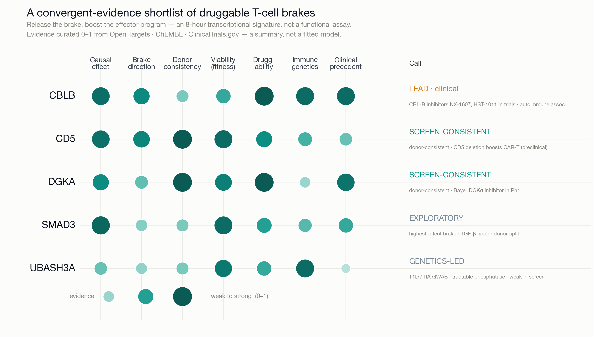

# Brakepoint · druggable-brake target discovery in human T cells — Built with Claude Science

*The most powerful immunotherapies — checkpoint blockade, CAR-T — all work by releasing **brakes** on T cells. Brakepoint screens the genome for the druggable ones.*

**Built with Claude: Life Sciences · research track (solo).** From a
2.6-million-cell CRISPRi Perturb-seq screen, Brakepoint nominates a shortlist of
**druggable targets** whose knockdown releases the brakes on human CD4⁺ T-cell
effector function — led by **CBLB**, already in the clinic. Every target traces
back to versioned, Claude-Science-provenanced code.

> **Demo (≤3 min):** [`deliverables/demo.mp4`](deliverables/demo.mp4) · narration deck with verbatim VO in the speaker notes: [`deliverables/demo_deck.pptx`](deliverables/demo_deck.pptx) · script: [`deliverables/demo_script.md`](deliverables/demo_script.md) · **Landing page:** [`deliverables/index.html`](deliverables/index.html) · **Written summary:** [`deliverables/summary.md`](deliverables/summary.md)



## The finding — a shortlist of druggable T-cell brakes
A T-cell "brake" is a gene whose knockdown makes the cell a stronger effector.
From the **genome-scale Gladstone CRISPRi Perturb-seq** (**2,638,736 CD4⁺ T cells,
12,449 knockdowns**), Brakepoint nominates **five druggable brakes** by convergent
evidence (causal effect · direction · donor consistency · druggability · immune
genetics · clinical precedent):

- **CBLB** *(lead)* — E3-ligase brake; two oral CBL-B inhibitors in trials (NX-1607 Ph1, HST-1011 Ph1/2); genome-wide-significant autoimmune loss-of-function genetics.
- **CD5, DGKA** — donor-consistent brakes, clinically tractable (CD5 CAR-T programs; Bayer oral DGKα inhibitor in Ph1).
- **SMAD3, UBASH3A** — a high-effect TGF-β node and an autoimmune-GWAS phosphatase.

**How we find them.** Ranking by causal effect alone points at the wrong genes: 8
of the 9 largest effects are the cell's own TCR machinery (essential, not
druggable). A per-cell **direction-of-effect** axis flips it — 14 of the top 15
effects are required machinery (knockdown *cripples* the cell), donor-consistently
— and the drug-relevant brakes surface in the sparse positive quadrant.

The **positive quadrant** (knockdown *enhances* effector function) is the
therapeutic hypothesis space — and we report it honestly. At 2 donors it is noisy:
a curated set of known T-cell brakes is **not yet significantly enriched** there
(Mann–Whitney p = 0.56; `pipeline/brake_enrichment.py`), and the strongest raw
positives include likely artifacts. Individual literature brakes — **CD5, DGKA**
(donor-consistent), and the TGF-β node **SMAD3** (donor-split) — do land positive
as a consistency check, but the positive side is a **prioritized hypothesis space
for the full 4-donor cohort, not a finished target list**. Full write-up:
[`pipeline/real-finding-genomescale.md`](pipeline/real-finding-genomescale.md).

## Why it's trustworthy
- **Ranks by causal effect size** — power-equalized energy distance + a
  permutation E-test — not p-values, which inflate with cell count.
- **Adds the missing sign.** Magnitude can't tell an activation-*required* gene
  from a therapeutic *brake* — both land far from control. The signed axis does,
  and it self-validates: the TCR machinery is correctly flagged negative,
  donor-consistently.
- **Gated + honest:** viability (catches toxic knockdowns), author-provided
  knockdown efficiency, **donors as replicates** with a per-donor sign-agreement
  flag surfaced (not hidden).
- **Self-checking:** a real statistical bug — an n-dependent bias in the
  effect-size metric — was found and fixed with the Claude Science reviewer's help
  (see [`pipeline/WAR_LOG.md`](pipeline/WAR_LOG.md)).

## Reproduce
```bash
cd pipeline
make smoke      # dependency-free unit tests: E-distance core + signed axis + figure (runs anywhere)
make figure     # re-render the hero signed-causal-map figure from the merged leaderboard
# genome-scale (needs scanpy + the built h5ad on a GPU workstation):
make direction  DATA=<built.h5ad> LIB=<sgrna_library_metadata.csv> CONTROL=control
```
Fixed seeds, pinned `environment.yml`, one-command regeneration.

## How Claude Science got us there
Every result is a versioned artifact carrying its exact code, environment, and
conversation trail; a background reviewer checks claims against what actually ran.
The heavy genome-scale analysis runs on an **NVIDIA DGX Spark** over Claude
Science's SSH remote-compute; the signed direction axis over 2.64 M cells
completes in ~40 s.

## Repository layout
```
pipeline/
  edistance_core.py        power-equalized E-distance + permutation E-test (unbiased U-statistic)
  run_pipeline.py          QC → scVI embedding → E-distance ranking → viability + knockdown gates
  direction.py             signed effector-vs-dysfunction axis (CD4 + CD8 modules; unit-tested)
  direction_genomescale.py per-cell scoring on the 2.64M-cell build (row-chunked; runs on the DGX)
  merge_direction.py       merge the signed score + tier into the leaderboard
  figure_causal_map.py     the hero figure (signed causal map)
  Makefile · environment.yml · LICENSE (MIT) · SOURCES.md
  outputs_gladstone/       ranked_perturbations.csv (+ direction_*), direction_meta.json, figures
  real-finding-genomescale.md   the finding, with real numbers + honest caveats
deliverables/
  demo.mp4 · demo_deck.pptx (VO in notes) · demo_script.md · index.html · summary.md · figures/causal_map.*
```

## Data & license
Code: **MIT** ([`pipeline/LICENSE`](pipeline/LICENSE)). Primary data: the
Gladstone genome-scale CD4⁺ T-cell CRISPRi Perturb-seq (Marson lab; CZI Virtual
Cells Platform) — expression + DESeq2 DE + supplementary signature tables.
Public evidence layers: **STRING v12** (interactome) and **Open Targets** (human
genetics); public validation sets (Shifrut/Marson, Datlinger) via scPerturb. There
is **no Gladstone-provided interaction network or regulatory model** — STRING and
Open Targets are public layers on top of the provided Perturb-seq data, not
substitutes for it. Provenance and licenses in
[`pipeline/SOURCES.md`](pipeline/SOURCES.md); only openly-licensed evidence is
bundled (no DrugBank).

---
*Repository: https://github.com/duanchengchen-oss/brakepoint · Demo video: https://duanchengchen-oss.github.io/brakepoint/deliverables/index.html*
